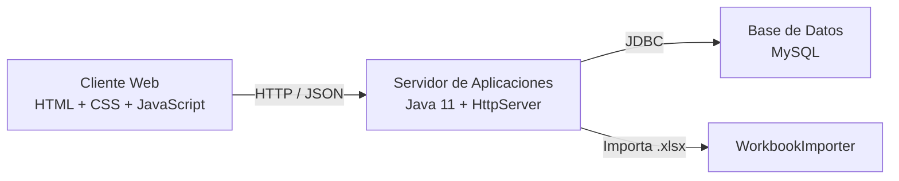

# Arquitectura SVCL

## Vista general

## Capas

- **Cliente**: renderiza login, carga de Excel, captura manual y consultas de cobertura.
- **Servidor**: expone endpoints REST sencillos (`/api/login`, `/api/status`, `/api/search`, `/api/import`, `/api/manual-entry`).
- **Persistencia**: `CoverageRepository` crea esquema, inserta registros, actualiza metadatos y consulta cobertura/distancias en MySQL.

## Flujo principal

1. El usuario inicia sesion.
2. El frontend consulta el estado de la base.
3. El usuario importa un Excel o agrega un registro manual.
4. El backend procesa el archivo, guarda datos en MySQL y actualiza `metadata`.
5. El usuario busca por codigo postal y sucursal origen.
6. El backend consulta `coverage`, cruza con `distances` y devuelve el dictamen.
